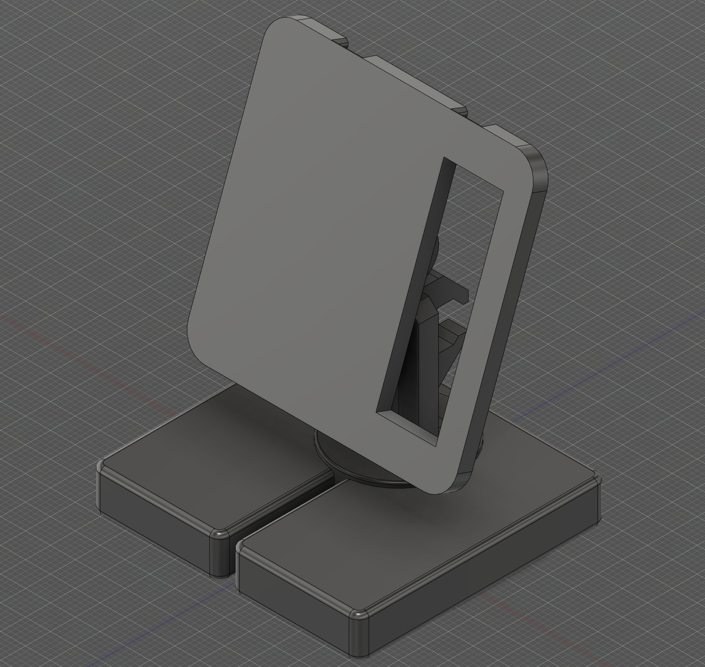
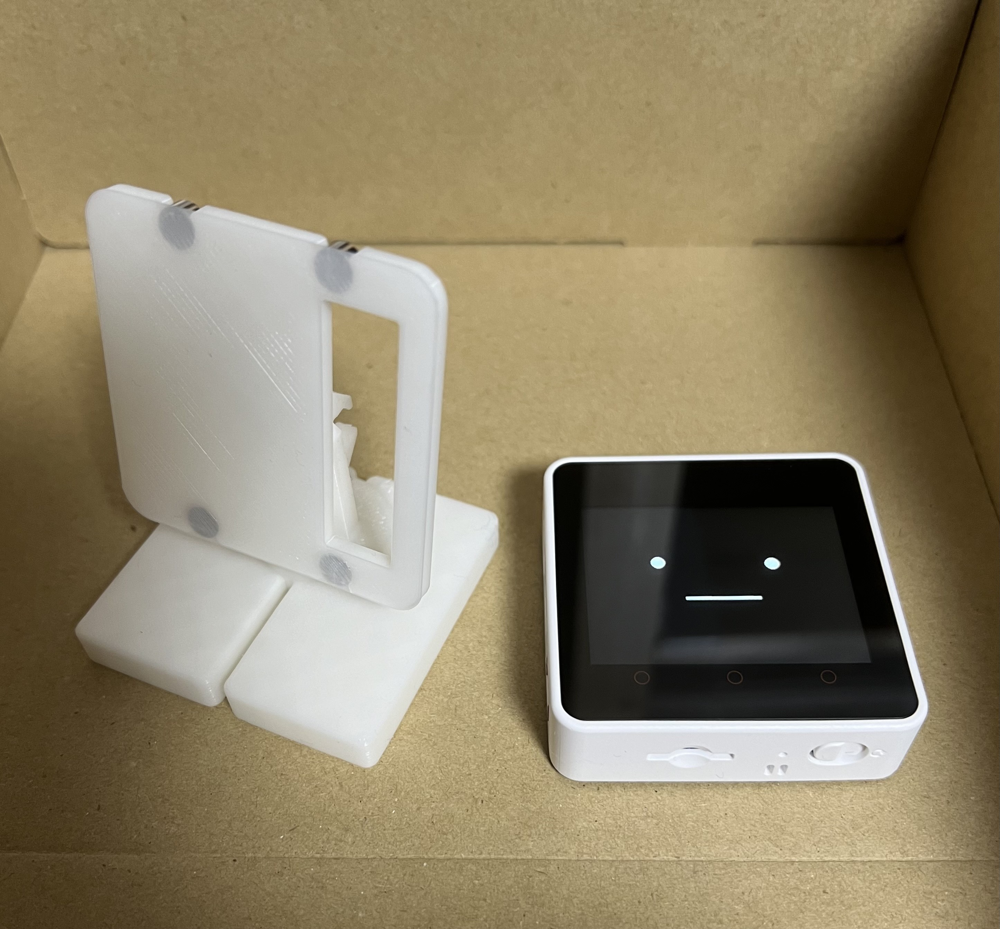
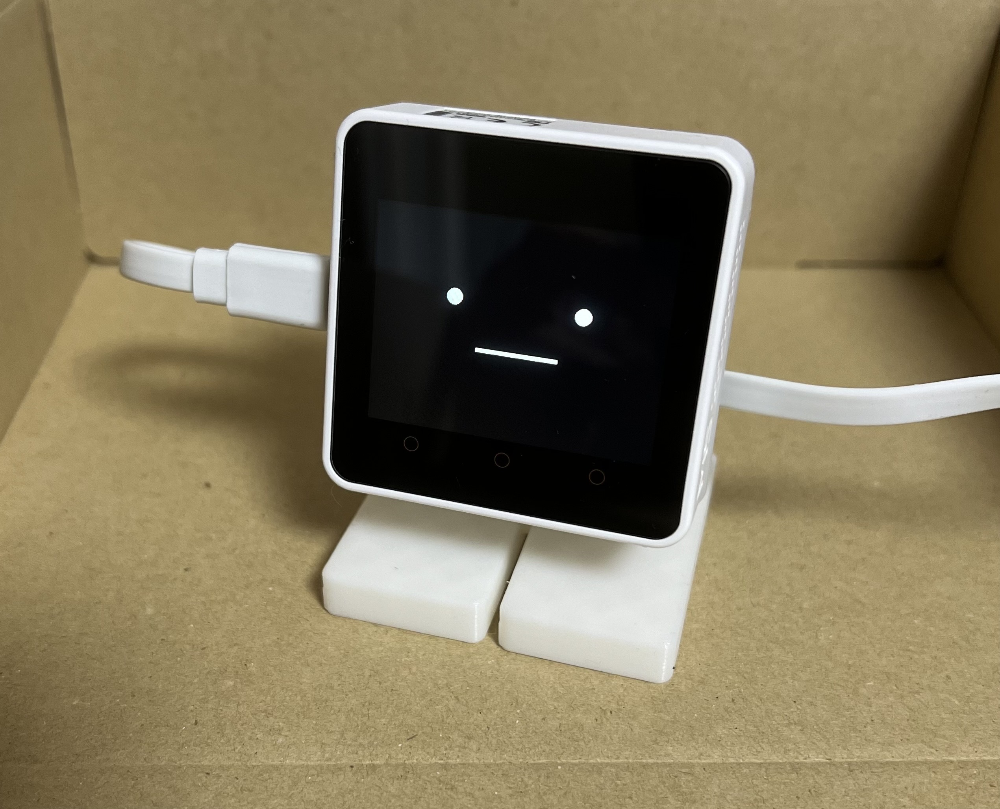

# ｽﾀｯｸﾁｬﾝ用スタンド

サーボを使わずにｽﾀｯｸﾁｬﾝを楽しむためのスタンドです。

M5Stack本体はプレートに埋め込んだ磁石で保持します。プレートにはCORE2のM-BUS用に通し穴が開けてあります。

## 作り方

STLファイルは以下の通りです。

* base.stl
  * 台座の部分
* base_without_hook.stl
  * 台座の部分（ケーブルフック無し）
* plate.stl
  * M5Stackを保持するプレート部分

3Dプリンターでbase.stl（あるいはbase_without_hook.stl）とplate.stlをプリントします。

台座の支柱に付いているケーブルフックが不要な場合はbase.stlの代わりにbase_without_hook.stlを使用します（形成されるサポートも少なくて済みます）。

プレートには6x3mmのネオジム磁石をはめ込みます。磁石の向きを間違えないように気を付けてください。

台座とプレートはM3x10mm（もっと長くてもOK）のネジとナットで固定します。ワッシャーも入れると良いです。
